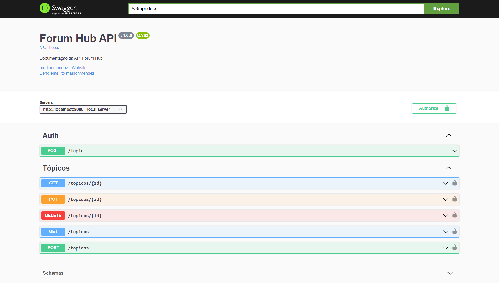

# Forum Hub API

<div align="center">

[](https://opensource.org/licenses/MIT)
[](https://www.java.com/)
[]()
[]()

[](https://spring.io/projects/spring-boot)
[](https://hibernate.org/)
[](https://maven.apache.org/)
[](https://www.postgresql.org/)
[](https://swagger.io/)

</div>

## Sobre
O Fórum Hub é uma API REST de um fórum fictício, um espaço onde podemos criar tópicos e trocar conhecimentos no intuito de solucionar problemas e sanar nossas dúvidas.
Este foi um desafio proposto no programa Oracle Next Education. As tecnologias usadas abrangem conceitos como migrações de banco de dados, tratamento de exceções, autenticação usando JWT, filtros em requisições, validações personalizadas e documentação do Swagger.

[]()

## Funcionalidades

### Usuário

- Efetuar login com autenticação JWT.

### Tópicos

- Cadastro de tópicos.
- Listagem de todos os tópicos disponíveis.
- Visualização detalhada de um tópico.
- Atualização dos dados de um tópico.
- Remoção de tópico.

### URL da Documentação

``` bash
http://localhost:8080/swagger-ui/index.html
```

## Licença

Este projeto está licenciado sob a [Licença MIT](LICENSE).
